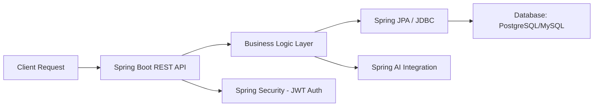

<!-- Profile Header -->
<h1 align="center">👋 Hi, I'm Venkata Rami Reddy Bobbala</h1>
<h3 align="center">🚀 Java Backend Developer | Spring Ecosystem | Microservices | AI Integration</h3>

  
  
  

---

### 🌩️ About Me

I'm a **Java Backend Developer with 4 years of professional experience** specializing in the **Spring ecosystem**.  
I focus on **building scalable microservices, optimizing database interactions, and integrating AI into enterprise applications** using **Spring AI**.  

I’m passionate about **system maintainability, performance optimization, and modern design patterns** that reduce boilerplate code and improve scalability.

---

## 📄 Resume

📥 [Download My Resume](https://github.com/venkataramireddy1999/resume/blob/main/VENKATA_RAMI_REDDY_BOBBALA_RESUME.pdf)

---

### 🧰 Tech Stack

| Category | Tools & Technologies |
|-----------|----------------------|
| 💻 **Languages** | Java (8/11/17), SQL |
| 🧩 **Frameworks** | Spring Boot, Spring MVC, Spring JPA, Spring JDBC, Spring Security, Spring AI, Spring AOP |
| ⚙️ **Architecture** | Microservices, RESTful APIs, Event-Driven Architecture |
| 🛠️ **Tools & Build** | Git, Maven, JUnit, Mockito |
| 🗄️ **Databases** | PostgreSQL, MySQL |

---

### 🏗️ Backend Workflow Overview

---

🧠 Experience

🧩 4 Years of Experience as a Java Backend Developer at TCS
💡 Expertise in Spring Boot, Microservices, and AI-powered enterprise solutions
🔒 Strong background in API security, performance optimization, and modular architecture

---

🛠️ Tool Badges

---

📊 GitHub Stats

---

🤝 Connect With Me

⭐ If you find my profile interesting, please follow me and stay tuned for future backend projects!
